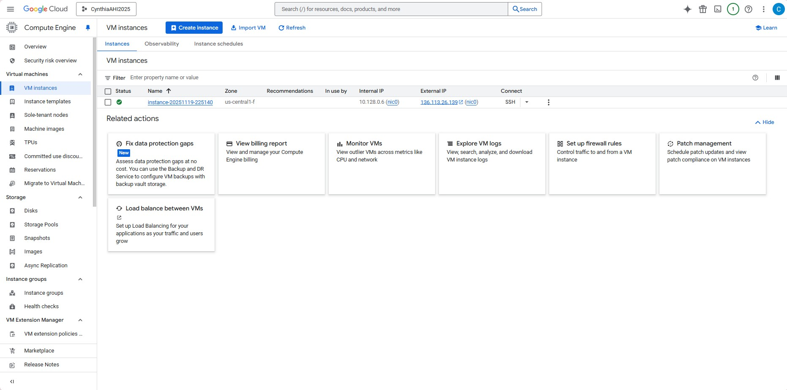
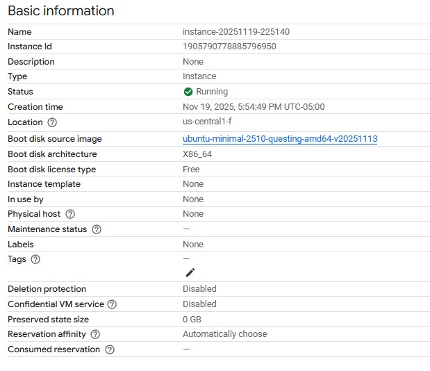
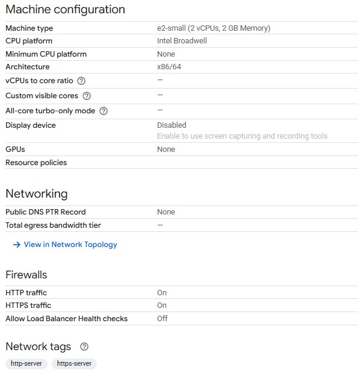
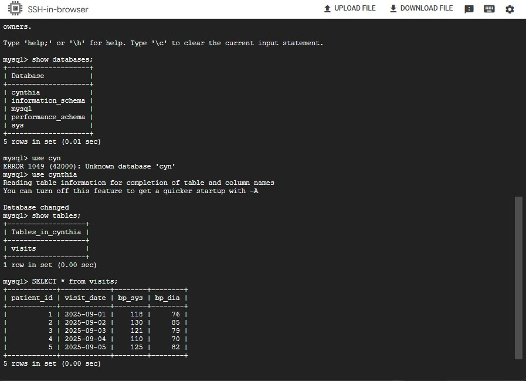
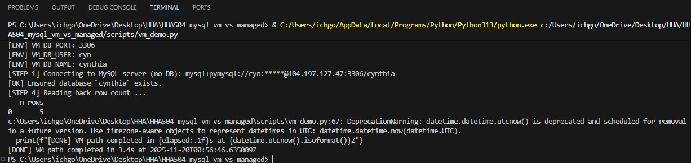
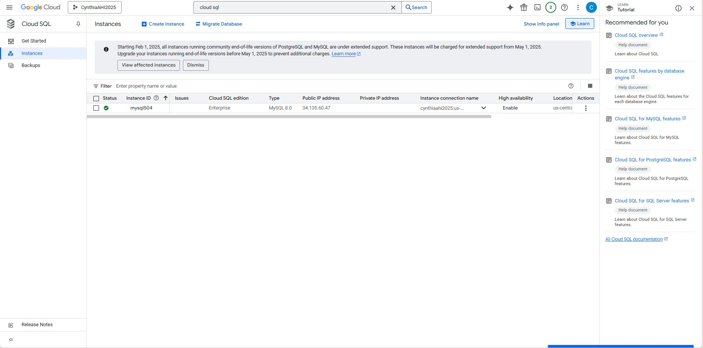
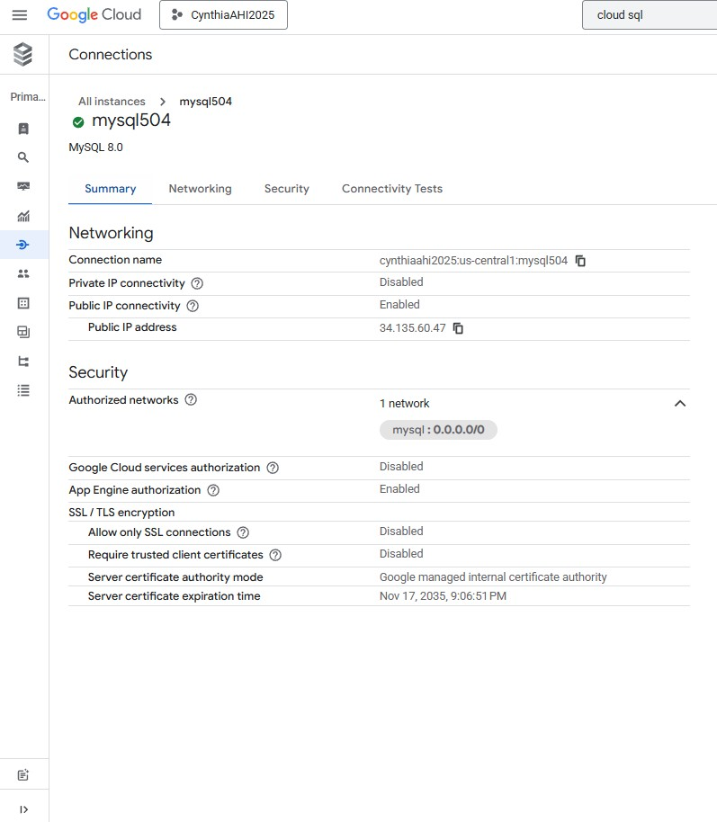
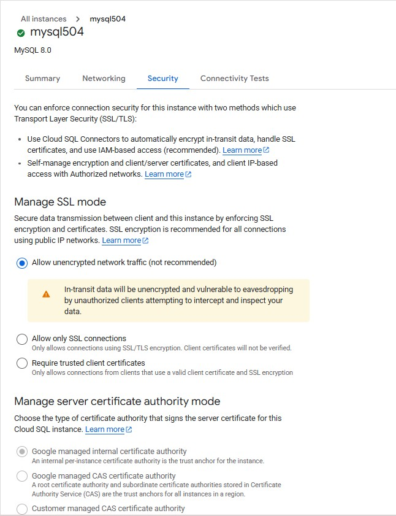
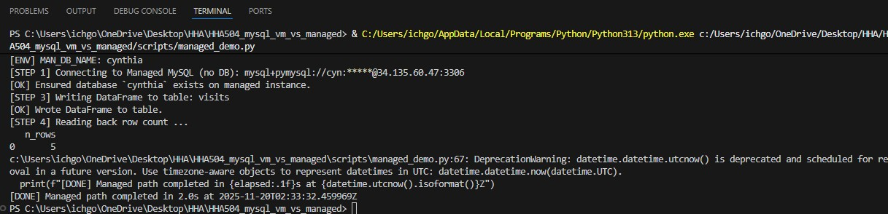
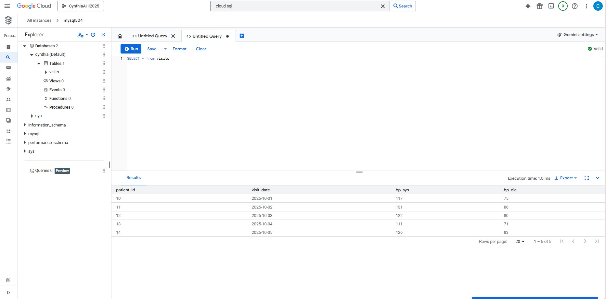

# HHA504_mysql_vm_vs_managed

## Recording 
Zoom Recording: [VM vs. Managed](https://drive.google.com/file/d/1-MEdJ47KUweX26pLBAeCOmpsZAnJB4rS/view?usp=drive_link)

## Virtural  Machine
### VM creation
1. Select instance to create.
2. Choose E2 for price and usability.
3. Choose e2-small for minimum of 2GB of memory.
4. Choose Ubuntu OS system.
5. Everything else kept to default and hit enter.

### Firewall configuration
1. Create a firewall rule.
2. Name it and give it a description.
3. Set IP range to 0.0.0.0/0 to allow all IPs.
4. Set protocol to TCP:3306

### SSH steps
1. Type `sudo apt-get update` to update the OS system.
2. Type `sudo apt install mysql-server mysql-client` to install mysql into the server.
3. Type `sudo mysql` to log in into mysql.
4. Type `CREATE USER 'xxx'@'%' IDENTIFIED BY 'xxx';` to add user to database.
5. Type `GRANT ALL PRIVILEGES ON *.* TO 'xxx'@'%' WITH GRANT OPTION;` to give all privileges to the user.
6. Download Nano.
7. Type `sudo nano /etc/mysql/mysql.conf.d/mysqld.cnf` to edit mysqld.cnf file.
6. Input `0.0.0.0/0` in the mysqld.cnf to allow for other network connections.
7. Restart SSH and input `mysql -u 'xxx' -p` to locally test the user connection to mysql.
8. Input the password you set to the username.

Secrets can be stored in an .env file

## Managed Cloud SQL
### Cloud SQL
1. Select to create a sandbox MySQL instance.
2. Name instance and set a password.
3. Select a region press create.

### Configuration
1. Add `0.0.0.0/0` to authorized networks.
2. Disable SSL only connection for security.
3. Add a new user with a username and set a password for it.

DB_HOST, DB_PORT, DB_USER=class_user, DB_PASS, DB_NAME information can be stored in an .env file

## Screenshots
### VM 

Running VM

VM Configuration

SSH Connection to MySQL

Python Script Results

VM Firewall Rule

### Managed

Running Managed

Managed network and security

Python script results

Managed query
